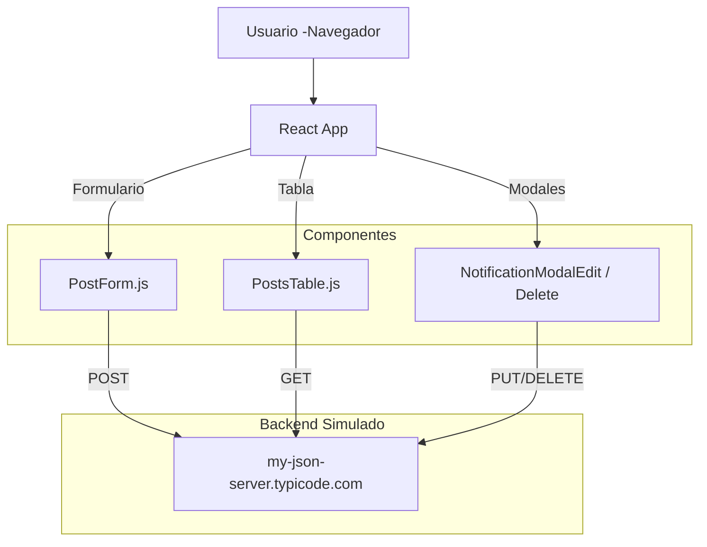

# 📄 Prueba Técnica - Camilo Yaya

Este proyecto es una SPA (Single Page Application) construida con **React** y **Material UI** que permite realizar operaciones CRUD simuladas (crear, editar, eliminar) sobre una colección de publicaciones (`posts`) utilizando una API mockeada en JSON Server alojada en GitHub.

---

## 🧠 Arquitectura del Proyecto



---

## 🧩 Estructura de Carpetas

```
prueba_tecnica_camilo_yaya/
├── public/
│   └── index.html, favicon, logos, manifest
├── src/
│   ├── components/
│   │   ├── items/               # Botón reutilizable
│   │   ├── modals/              # Modales de edición y eliminación
│   │   └── views/               # Formulario de creación y tabla principal
│   ├── App.js                   # Rutas y estructura general
│   ├── index.js                 # Punto de entrada React
│   └── ...
├── db.json                      # Datos simulados para JSON Server
├── package.json
└── README.md
```

---

## 🚀 Tecnologías Utilizadas

- React 18
- Material UI (`@mui/material`)
- React Hook Form
- Axios
- JSON Server (hosteado en GitHub vía typicode)
- Snackbar y Modal (UX/MUI)
- React Router

---

## 📦 Instalación y ejecución

```bash
# 1. Clona el repositorio
git clone https://github.com/CamiloYaya-dev/prueba_tecnica_camilo_yaya.git
cd prueba_tecnica_camilo_yaya

# 2. Instala las dependencias
npm install

# 3. Ejecuta el proyecto
npm start
```

La aplicación se abrirá en `http://localhost:3000`.

---

## ✨ Funcionalidades

- ✅ Crear publicaciones con título (POST).
- 📝 Editar publicaciones existentes desde modal (PUT).
- ❌ Eliminar publicaciones con confirmación (DELETE).
- 📋 Ver publicaciones en una tabla responsive.
- 🔔 Feedback visual de éxito o error (Snackbar).
- 🔄 API simula persistencia de datos usando `db.json`.

---

## 🔗 API Simulada

El proyecto consume endpoints mockeados en:

```
https://my-json-server.typicode.com/CamiloYaya-dev/prueba_tecnica_camilo_yaya/
```

Usando endpoints como:

- `GET /get`
- `POST /post`
- `PUT /put/:id`
- `DELETE /delete/:id`

> Los datos provienen del archivo `db.json` versionado en el repositorio.

---

## 📄 Licencia

Este proyecto fue desarrollado como parte de una **prueba técnica personal**. Es de uso libre para revisión técnica o aprendizaje.

---

## 👨‍💻 Autor

**Camilo Yaya**  
[GitHub](https://github.com/CamiloYaya-dev)
